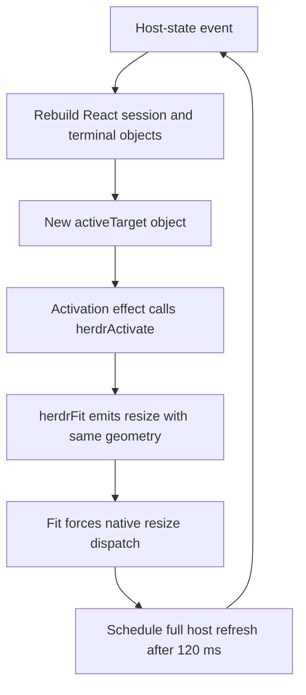

Whip Android bottlenecks — Perfetto and source analysis, September 16, 2026

Two actionable issues stand out: continuous decorative animations consume most of the host-list rendering CPU, and a resize/refresh/reactivation path can keep generating terminal work without a selection or geometry change. JavaScript saturation is directly measured during the slow terminal transitions. Its exact per-function CPU breakdown is not available in these system traces.

The installed APK reports Whip 1.7.0, build 221, Git commit `52ab702943b6bf4e37e5277e07f55d8a1b30b389`. Its terminal HTML is byte-identical to `android/app/src/main/assets/herdr-terminal.html` in the checkout. The key projection, resize-refresh, animation, and native callback paths described below are present in that commit. Later checkout changes include chat viewport restoration and terminal focus handling; this report does not claim those changes were measured.

**1. Confirmed: continuous status animations drive expensive idle rendering.**

A normal / reduced-motion / restored-normal experiment kept Whip on the same host-list screen in the same process (PID 24490). Each recording lasted approximately 15 seconds. Android thermal status remained LIGHT. Only `transition_animation_scale` changed, from `1.0` to `0` and back to `1.0`; the setting reaches Whip through React Native's reduce-motion accessibility event. The original setting was restored and verified.

| Measurement | Normal before | Reduced motion | Normal restored |
| --- | ---: | ---: | ---: |
| Whip CPU, percent of one core | 66.40% | 10.89% | 65.43% |
| RenderThread CPU | 39.17% | 0.29% | 38.18% |
| Main-thread CPU | 15.82% | 5.65% | 15.73% |
| JavaScript CPU | 4.34% | 3.86% | 4.15% |
| App surface frames | 908 | 4 | 909 |

Disabling motion reduced whole-app CPU by approximately 83.5% relative to the average normal condition. Telemetry remained active (five/six/six latency updates), so the reduction was not caused by disconnecting the host. The nearly symmetric before/after results strengthen the causal conclusion. This is CPU work, not a direct battery-power measurement. Reduced motion disables the animation set together; the experiment does not isolate the spinner from the glow or other status animations.

The matching code:

- [ReducedMotionProvider and status glyphs](../src/components/app-ui.tsx) consume the Android accessibility signal and disable status motion.
- `useConnectedHostBloom` in the same file repeats scale/opacity animation indefinitely over `statusBloomStyle`, which includes a blurred shadow. Connected/active badges also use repeating bloom animation.
- [WhipAgentSpinnerView.kt](../modules/whip-native-spinner/android/src/main/java/io/github/kaminarios/whip/spinner/WhipAgentSpinnerView.kt) uses an infinite `ValueAnimator`, calling `invalidate()` on every update. Moving the spinner off JavaScript avoided JS animation work but still schedules continuous Android drawing.
- [AppBackground](../src/components/AppBackground.tsx) uses a static image; there is no timer or video loop there. Android native backdrop blur is disabled in [GlassSurface](../src/components/GlassSurface.tsx). Those should not be blamed without further evidence.

First optimization candidate: make persistent connection glows static, reserve animation for meaningful transient activity, and separately measure a lower-update-rate or otherwise cheaper spinner. Preserve reduced-motion behavior. Repeat this same experiment after a targeted change to isolate which visual costs most.

**2. Strongly supported: target identity changes create a resize/refresh feedback path.**

The earlier 30-second untouched-terminal trace contains 41 fit events and 41 native resize-dispatch spans. The switching trace contains 76 of each. Every recorded fit reports exactly `33x31`, cell size `28x68`; there was no phone rotation or scripted geometry change. The switching trace contains only eight tab-selection spans. Fit computation was usually 0–0.2 ms, so the significant issue is the work a fit triggers, not the arithmetic inside `fit.fit()`.

The source forms this cycle:

Concrete links in that path:

1. [useSessionConnectionLifecycle.ts](../src/hooks/useSessionConnectionLifecycle.ts), `acceptHostState`: invokes `commitAppCore(appCoreRef.current.view())` for host-state events. `startTransition` lowers React update priority; the native projection call itself still runs synchronously inside the callback.
2. [useSessionRuntimeManager.ts](../src/hooks/useSessionRuntimeManager.ts), `commitAppCore`: projects both terminal state and host sessions. [useTerminalSessions.ts](../src/hooks/useTerminalSessions.ts), `stateFromView`, allocates a new map, rail arrays, and terminal objects every time; [liveHostSessions.ts](../src/liveHostSessions.ts), `projectAppCoreSessions`, similarly returns new session objects.
3. [useSessionTerminalLifecycle.ts](../src/hooks/useSessionTerminalLifecycle.ts), `terminalTargets`: maps those changed collections to new target objects.
4. [TerminalRendererHost.tsx](../src/components/TerminalRendererHost.tsx), activation effect: depends on the full `activeTarget` object, not just selected terminal identity. It calls `herdrActivate` even when the selected key is unchanged, including its hidden-screen branch.
5. [herdr-terminal.html](../android/app/src/main/assets/herdr-terminal.html), `herdrActivate`: unconditionally calls `herdrFit`. The explicit `resize()` path always emits a fit message. Commit `52ab702` suppresses duplicate window/viewport resize events through a geometry signature; it deliberately leaves explicit activation fits unguarded.
6. [terminalRenderer.ts](../src/lib/terminalRenderer.ts), `terminalResizeForcesNativeDispatch`: returns true for every fit. [TerminalBridgeController.ts](../src/services/TerminalBridgeController.ts), `resizeTerminal`, schedules a state refresh after every dispatched Herdr resize. `scheduleStateRefresh` debounces for 120 ms and calls `runtime.refreshState()`.
7. [host_runtime/events.rs](../packages/react-native-whip-ssh/rust/src/host_runtime/events.rs) publishes state at the beginning and completion of refresh, bringing execution back to step 1.

This is a concrete self-retriggering path in the installed source, supported by repeated native sends with identical geometry. Individual host-refresh and activation calls were not correlated with unique IDs in the capture, so the trace cannot assign every resize to this cycle or quantify its share of total CPU yet. A user-selected repaint and ownership takeover still legitimately require same-size sends; a blanket geometry filter would break those semantics.

First optimization candidate: separate updating an entry's metadata from activating it. Activate/refit only when the selected key, visibility/resume state, or geometry requires it; preserve explicit redraw and takeover paths. Preserve unchanged rail/target references or use revision-based projections. Reconsider full-host refresh after a resize when authoritative events already supply the necessary state. Verify with a fixed terminal left untouched: repeated same-geometry sends should stop while output, cold attach, return-to-tab redraw, rotation, and takeover continue to work.

This feedback path also qualifies the earlier historical comparison: a larger count of terminal-update markers can include output provoked by Whip's own redraw requests. It is not independent proof of a heavier remote workload.

**3. Confirmed: JavaScript execution delays tab selection and blocks native delivery.**

Across the eight tab-selection-to-renderer-entry spans:

- Total elapsed time: 3,082 ms.
- JavaScript scheduled execution overlapping those spans: 2,854 ms (92.6%).
- JavaScript runnable but waiting for a CPU: 187 ms (6.1%).
- Individual spans: 336–478 ms, with 321–408 ms of JavaScript execution each.

The selection marker starts in `chooseTab`/`choosePane` in [SessionScreen.tsx](../src/components/SessionScreen.tsx). It ends in `ensureEntry` in [TerminalRendererHost.tsx](../src/components/TerminalRendererHost.tsx), before terminal connection/resize completion. Local selection is published before the awaited remote focus operations. These measurements therefore establish substantial local work before the renderer is even reached; this interval is not an SSH round-trip timer.

Whole-host FFI projections, unconditional rebuilding of React render state, and resulting screen reconciliation are specific candidates for that work. [AppShell.tsx](../src/components/AppShell.tsx) also computes a Rust Herd projection when its `sessions` dependency changes, even when another screen is shown. The system trace does not contain a Hermes sampled stack profile, so assigning all 2,854 ms to any one of these functions would overstate the evidence.

The worst measured Rust delivery callback in the switching trace lasted 732.99 ms. Its native worker used only 0.12 ms of CPU and slept for 732.87 ms; meanwhile JavaScript ran for 551.03 ms. Another callback lasted 647.56 ms, with 4.65 ms native CPU, 641.69 ms sleeping, and 606.77 ms JavaScript CPU. This directly distinguishes callback waiting from heavy Rust computation in those spans.

The matching native path is `deliver_unix_socket_frames` in [ssh/mod.rs](../packages/react-native-whip-ssh/rust/src/ssh/mod.rs), followed by Rust terminal decoding/base64 delivery in [herdr_terminal.rs](../packages/react-native-whip-ssh/rust/src/herdr_terminal.rs), and the `HerdrTerminalEventSink.terminal_frame` callback wrapper in [generated/whip_ssh.cpp](../packages/react-native-whip-ssh/cpp/generated/whip_ssh.cpp). The wrapper uses `callInvoker->invokeBlocking`; each channel's owned frame delivery is awaited in order. The Rust span can therefore remain open while waiting for the busy JS thread. Replacing the blocking call blindly would violate the existing buffer-lifetime contract; first reduce the work and unnecessary updates on JS, then evaluate an owned, bounded asynchronous handoff if still needed.

**4. Measurement limit: current WebView markers include the return trip to JavaScript.**

The 475 ms WebView-delivery p95 during tab switching does not prove WebView injection itself takes that long. The WebView emits `trace-write-received` on entry, but the marker ends only when React Native's `handleMessage` runs. The same applies to `trace-xterm-written`. [performanceTrace.ts](../src/services/performanceTrace.ts), [TerminalRendererHost.tsx](../src/components/TerminalRendererHost.tsx), and the installed terminal HTML establish those boundaries.

Resize detail markers give an independent clue: they include a timestamp captured inside the WebView. The recorded return-to-JS queue delay reached 628 ms during live output and 657 ms during switching, while local fit time was around 0–0.2 ms. That supports delayed JS event handling as a substantial part of the observed WebView latency.

For a follow-up, carry WebView-local timestamps for write entry, xterm completion, and animation-frame acknowledgement in one diagnostic message. Keep clock-domain differences explicit. This separates local WebView work from delayed receipt on JS and reduces trace-only message amplification (currently up to three acknowledgement messages per traced terminal update).

The inbound byte counter sums to approximately 268 KiB during the live trace and 364 KiB during switching, over 30 seconds each. Mean payloads were 534 and 639 bytes. These counters cover renderer-bound terminal payloads, not total SSH traffic; they do not establish a bandwidth bottleneck. JS decode, synchronous injection, and offline snapshot serialization were short at p95. The single 5.17-second chat-cache-persist span is asynchronous and does not by itself establish a main-thread stall.

Evidence and next validation

Raw files remain under `artifacts/perfetto/measurement-20260916/`. The `bottlenecks/` subdirectory holds the verified normal/reduced/normal traces, matching result JSON, screenshots, thermal state, original/restored setting values, installed build metadata, and `investigation.json` / `callback-wait.json` with the correlation queries. An initial motion experiment was rejected because the phone switched to another app; its result files were replaced by the verified foreground repeat.

Recommended order: break the resize/reactivation cycle for terminal responsiveness; reduce persistent animation cost for idle efficiency; then capture a Hermes CPU profile or narrowly instrument projection/render phases to attribute the remaining JS work. Confirm identical workload and process state before claiming a regression or improvement. No application code, installed APK, or saved app data was changed in this investigation.
